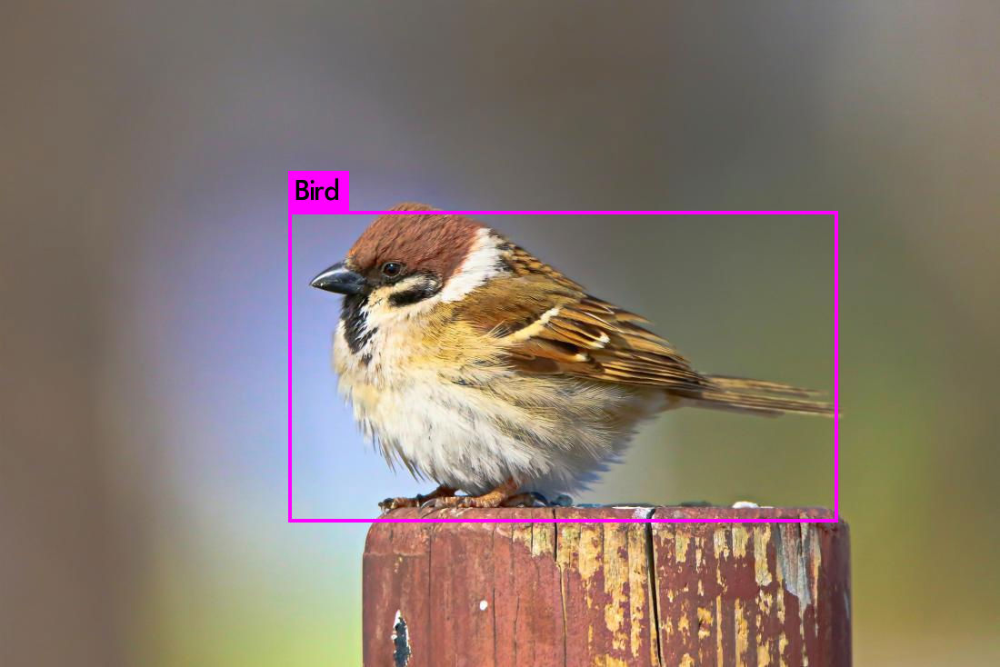
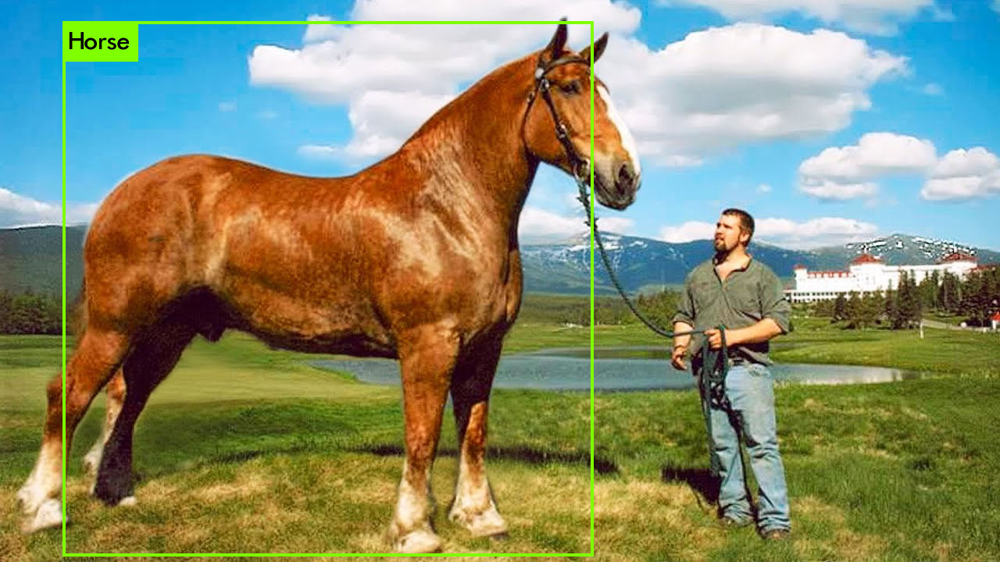

# darknet
Darknet object detector models

Currently included model(s):
1.Bird and Horse detection model using YoloV3 (in Bird_Horse_detection\backup\custom_final.weights)

Resule as below:

Usage:
  Put each file into correct Darknet Repo, then:
  To detect an image(in Darknet Repo): darknet.exe detector test data/custom.data cfg/custom.cfg backup/custom_final.weights bird.jpg
  To detect an video(in Darknet Repo): darknet.exe detector demo data/custom.data cfg/custom.cfg backup/custom_final.weights bird.mp4 -out_filename results.mp4
  To train custom weights, first move data to corresponding Darknet's folder, then:darknet.exe detector train data/custom.data cfg/custom.cfg darknet53.conv.74 (darknet53.conv.74 This is a YoloV3 weights, can be downloaded from its website)
